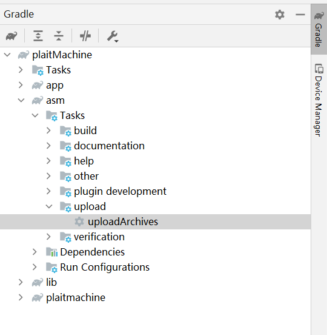
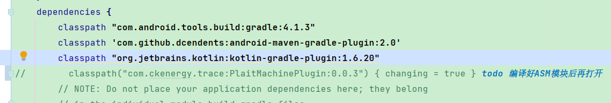
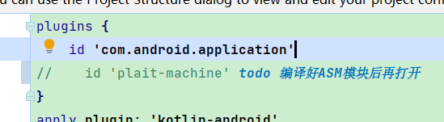
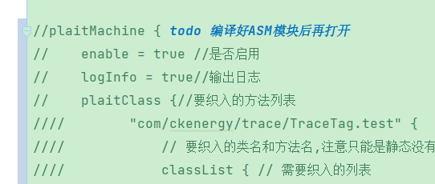

# PlaitMachine(织布机)

1、	织布机是一个开源的android studio asm编译期进行的插桩插件，可以自定义要插桩的方法、被插入的代码位置和黑名单（要排除）方法。

2、	被插入代码的位置支持配置配置注解和包类名等多元的方式减少配置的次数。

3、	插桩方法都会返回一个包装过的context，可以获取到当前插入方法的类名、方法名、参数内容和注解信息等，用户可以根据自己的需求使用这些信息。

4、支持增量编译，只会对修改过的类进行插桩。

## 重要！！！
1、第一次打开工程需要先编译asm 模块下的uploadarchives生成本地插件，否则将插件无法生效


按图示点击uploadarchives即可生成本地插件，或者使用命令行输入当前工程.\gradlew uploadarchives（注意mac下使用./）

2、编译好以后则可以去掉下列注释







注：如果第一次打开发现自己无法编译，则可以查看下当前内容是否注释了

### 使用方式

```groovy
plaitClass {//要织入的方法列表
        "com/ckenergy/trace/TraceTag.test" {
            // 要织入的类名和方法名,注意只能是静态和返回值的方法
            classList { // 需要织入的列表
                "com/ckenergy/trace/*" { //要织入位置的类名或包名
                    // 要织入位置 类中的方法 默认去除了<cinit>静态初始化和<init>, toString构造函数 如果需要只需要加入就行了
                    methodList = ["all*"]//all* 代表所有方法
                }
            }
        }
        blackClassList { // 需要过滤的方法
            "com/ckenergy/trace/*" {//类名或包名
                methodList = ["doSomeInIgnore"]
            }
            "com/ckenergy/*" {//配置注解
                methodList = ["@com/ckenergy/trace/NoTrace"]
            }
        }
    .....
}
```


### 还需要优化的地方 TODO

1、优化PlaintContext内方法上注解内容的包装，现在只是简单的使用了Map来保存

2、优化从白名单里排除黑名单方法的算法，现在使用的是双重for循环，如果在配置的方法过多时会有性能问题

3、支持配置继承了结构来定位需要插桩的位置 （现在需要的话可以通过PlaintContext获取当前实例current instanceof 来判断）

比如：
```groovy
classList { // 需要织入的列表
    "extends com/ckenergy/trace/A" { //配置继承了A类的数据进行插桩
        methodList = ["all*"]//all* 代表所有方法
    }
}
```

对以上有感兴趣想支持和帮助的小伙伴，可以邮件告知我（2ckenergy@gmail.com）认领以上的点，或者你有其他的想法也可以告知

Copyright 2022 ckenergy <2ckenergy@gmail.com>
Licensed under the Apache License, Version 2.0 (the "License");
you may not use this file except in compliance with the License.
You may obtain a copy of the License at

   http://www.apache.org/licenses/LICENSE-2.0

Unless required by applicable law or agreed to in writing, software
distributed under the License is distributed on an "AS IS" BASIS,
WITHOUT WARRANTIES OR CONDITIONS OF ANY KIND, either express or implied.
See the License for the specific language governing permissions and
limitations under the License.

